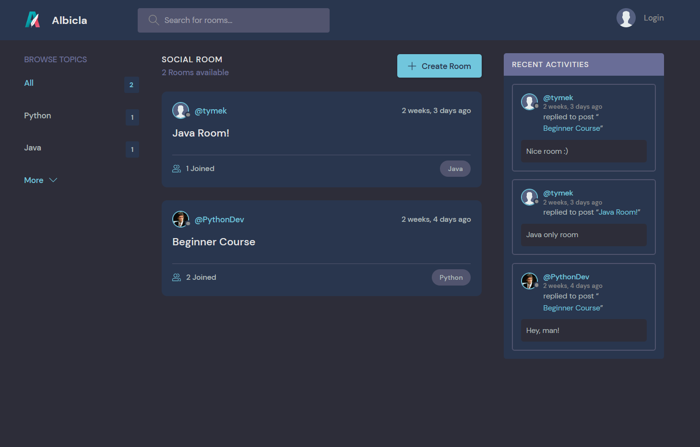
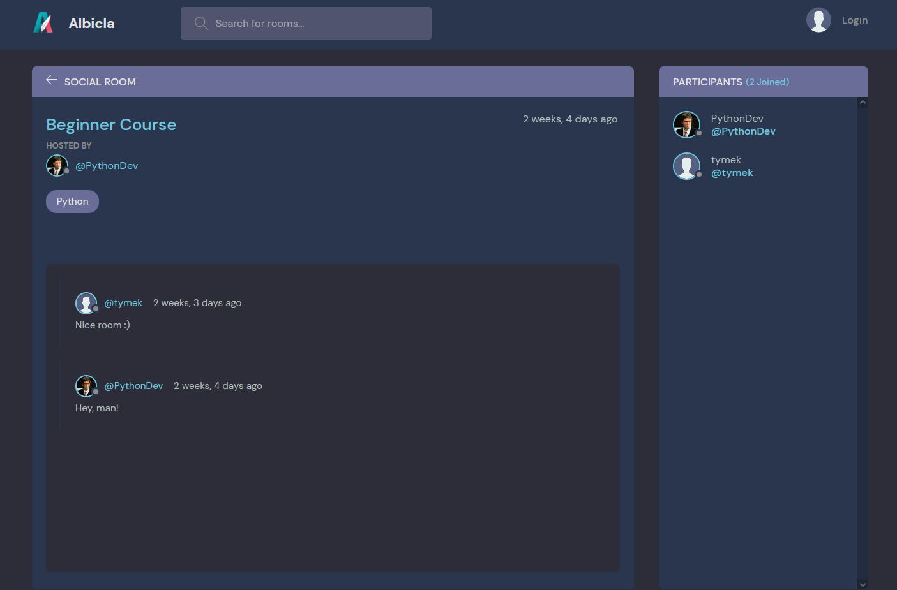
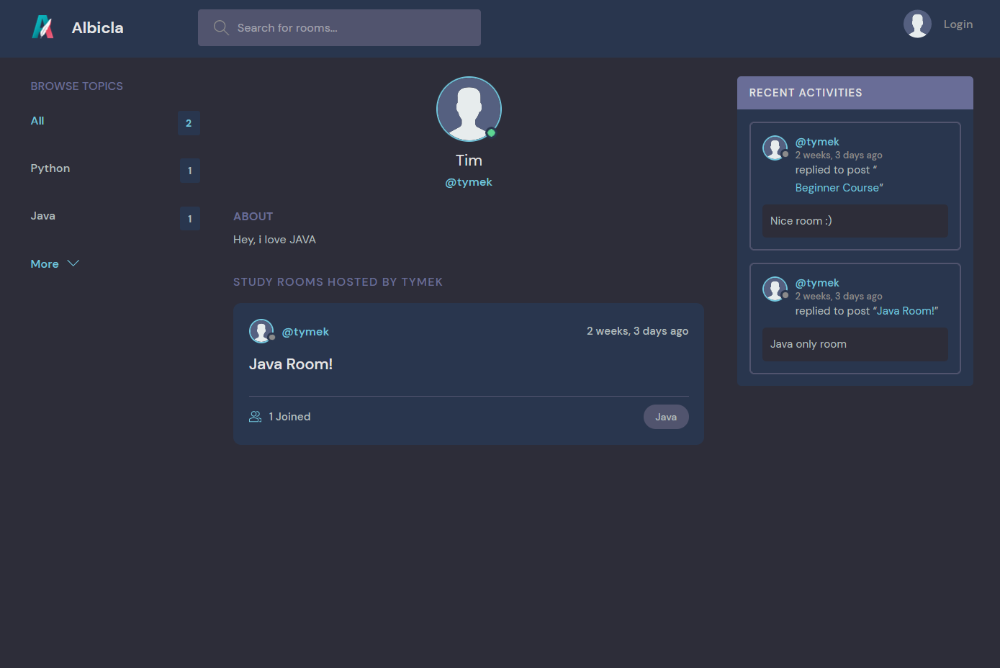
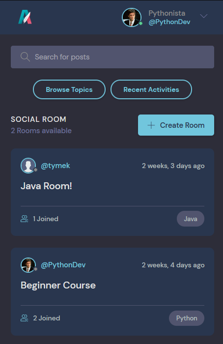

<div id="top"></div>
<!-- PROJECT SHIELDS -->
<div align="center">
  
  [![Contributors][contributors-shield]][contributors-url]
  [![Forks][forks-shield]][forks-url]
  [![Stargazers][stars-shield]][stars-url]
  [![Issues][issues-shield]][issues-url]
</div>

<!-- PROJECT LOGO -->
<br />
<div align="center">
  
  

  <h2 align="center">Django Social Rooms</h2>

  <p align="center">
    Social website app where users can create their own rooms or join already created and start conversation/networking.
    <br />
    <a href="https://github.com/Bunnicz/DjangoSocialRooms"><strong>Explore the docs »</strong></a>
    <br />
    <a href="https://github.com/Bunnicz/DjangoSocialRooms/issues">Report Bug</a>
  </p>
</div>


<!-- TABLE OF CONTENTS -->
<details>
  <summary>Table of Contents</summary>
  <ol>
    <li><a href="#disclaimer">Disclaimer</a></li>
    <li><a href="#about-the-project">About The Project</a></li>
    <li><a href="#requirements">Requirements</a></li>
    <li><a href="#screenshots">App preview</a></li>
    <li><a href="#contact">Contact</a></li>
  </ol>
</details>


<!-- DISCLAIMER -->
## Disclaimer
Project is based on youtube tutorial (Python Django 7 Hour Course by Dennis Ivy - Traversy Media)

Link to his github repo:
```
https://github.com/divanov11/StudyBud
```

Project logo and name "Albicla" was taken just for the learning purposes and it dosen't belong to me. © Albicla.com

<p align="right">(<a href="#top">back to top</a>)</p>


<!-- ABOUT THE PROJECT -->
## About The Project
<div align="center">
  
</div>
<br />

This repository contains social website app where users can create their own rooms or join already created and start conversation/networking.
Project is based on the tutorial by Dennis Ivy. I have used Django version 4.0.4 and later on updated to latest 4.0.6 version.
Template is used from tuturial and adjusted for this project needs.

Project consists of this main packages:
- Django (framework):
```
Vulnerable settings as a "SECRET_KEY" stored in dotenv with use of python decouple package
```
- Django REST framework (api):
```
Url: http://127.0.0.1:8000/api/
```
- Django CORS headers:
```
Allowed origins: "http://localhost:3000"
Regex: "/api/*"
```


<p align="right">(<a href="#top">back to top</a>)</p>


<!-- REQUIREMENTS -->
## Requirements
--> Clone the repository using the command below:
```bash
git clone https://github.com/divanov11/StudyBud.git
```

--> Move into the directory where we have the project files: 
```bash
cd DjangoSocialRooms
cd albicla
```

--> Create a virtual environment (python build-in venv package):
```bash
python -m venv venv
```

--> Activate the virtual environment:
```bash
source venv\scripts\activate
```

--> Install the requirements:
```bash
pip install -r requirements.txt
```

### Running the App

--> To run the App, use:
```bash
python manage.py runserver
```
> ⚠ Then, the development server will be started at http://127.0.0.1:8000/


<p align="right">(<a href="#top">back to top</a>)</p>


<!-- SCREENSHOTS -->
## App Preview:


<table width="100%"> 
<tr>
<td width="50%">
&nbsp; 
<p align="center">
  FEED VIEW
</p>
  
</td>
<td width="50%">
<br>
<p align="center">
  ROOM VIEW
</p>
  
</td>
<tr>
<td width="50%">
&nbsp; 
<p align="center">
  USER PROFILE VIEW
</p>
  
</td>
<td width="50%">
<br>
<p align="center">
  MOBILE VERSION VIEW
</p>
<div align="center">
  
</div> 
</td>
</table>

<p align="right">(<a href="#top">back to top</a>)</p>

<!-- CONTACT -->
## Contact

Kamil - kpodgorski367@gmail.com

Project Link: [https://github.com/Bunnicz/DjangoSocialRooms](https://github.com/Bunnicz/DjangoSocialRooms)

<p align="right">(<a href="#top">back to top</a>)</p>


<!-- MARKDOWN LINKS & IMAGES -->
<!-- https://www.markdownguide.org/basic-syntax/#reference-style-links -->
[contributors-shield]: https://img.shields.io/github/contributors/Bunnicz/DjangoSocialRooms.svg?style=for-the-badge
[contributors-url]: https://github.com/Bunnicz/DjangoSocialRooms/graphs/contributors
[forks-shield]: https://img.shields.io/github/forks/Bunnicz/DjangoSocialRooms.svg?style=for-the-badge
[forks-url]: https://github.com/Bunnicz/DjangoSocialRooms/network/members
[stars-shield]: https://img.shields.io/github/stars/Bunnicz/DjangoSocialRooms.svg?style=for-the-badge
[stars-url]: https://github.com/Bunnicz/DjangoSocialRooms/stargazers
[issues-shield]: https://img.shields.io/github/issues/Bunnicz/DjangoSocialRooms.svg?style=for-the-badge
[issues-url]: https://github.com/Bunnicz/DjangoSocialRooms/issues

[Albicla_logo]: albicla/static/images/logo.svg "Albicla Logo"
[feed_view_not_logged_in]: screenshots/feed_view_not_logged_in.png "Feed view user not logged in"
[feed_view_logged_in]: screenshots/feed_view_logged_in.png "Feed view user logged in"
[room_view]: screenshots/room_view.png "Room view"
[user_profile_view]: screenshots/user_profile_view.png "User profile view"
[mobile_view]: screenshots/mobile_view.png "Mobile view"
